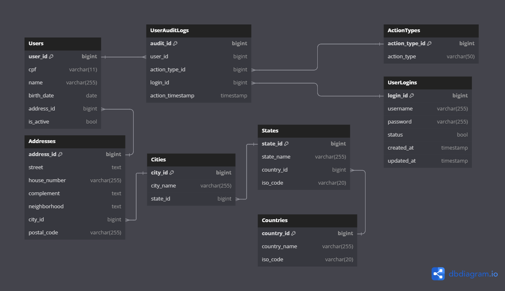
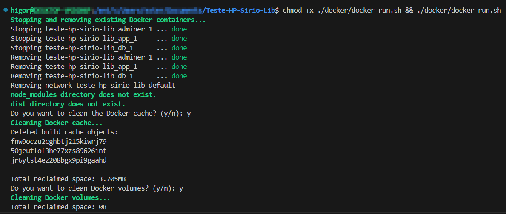
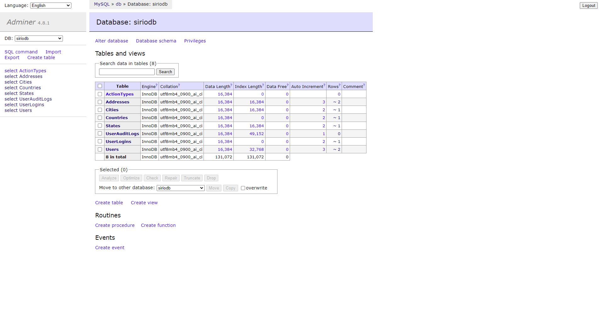
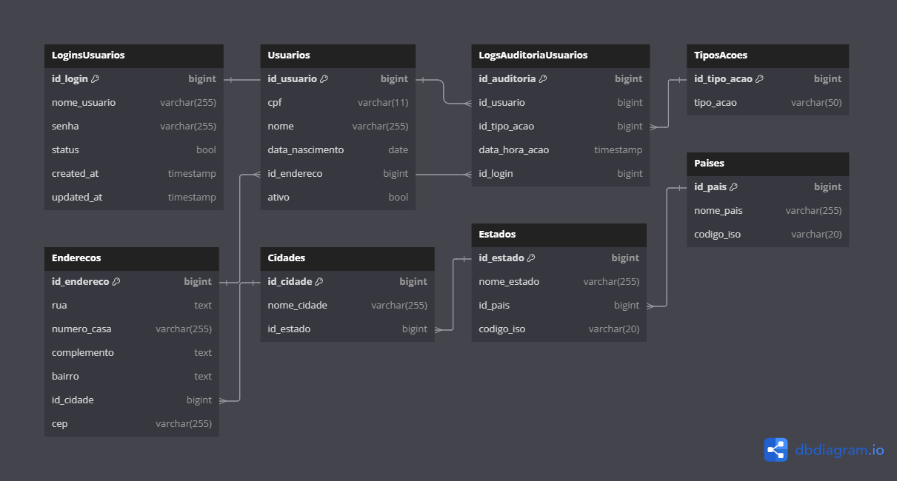
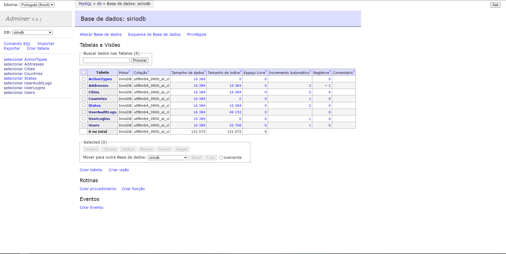

<div align="center">
   <a href="https://hospitalsiriolibanes.org.br/"></a>
</div>

---

## Language - Idioma

- [English Version](#overview)
- [Versão em Português](#visão-geral)

---

## 🇺🇸 - English Version

---

## Overview

This project is a test assignment for a position at Hospital Sírio-Libanês. My goal is to demonstrate my ability to develop, deploy, and manage a software solution that meets specific requirements.

### Key Features

- **API Testing**: The project includes various endpoints that I use to test different functionalities. The API is documented using Swagger, providing a comprehensive overview of each endpoint, including request parameters and response formats.

- **Database Management**: The project integrates with a database to handle and manage test data. I included Adminer for internal database management, allowing easy access and manipulation of database records.

- **Docker Integration**: Docker is used to containerize the application, facilitating a consistent development and deployment environment. Docker Compose manages the multi-container setup, ensuring that all required services are configured and running smoothly.

### Objectives

- **Follow RESTful Design Principles**: Implement microservices using RESTful principles to ensure a well-structured and scalable architecture.

- **Implement Security with JWT**: Apply JWT standard for authentication and authorization, ensuring secure communication between client and server.

- **Use MySQL for Persistence**: Employ the relational database MySQL for the persistence layer to manage data efficiently.

This project serves as a practical exercise to evaluate my technical skills and approach to software development in the context of a potential role at Hospital Sírio-Libanês.

---

## Technologies Used

- **Node.js**: A JavaScript runtime built on Chrome's V8 JavaScript engine.
- **TypeScript**: A typed superset of JavaScript that compiles to plain JavaScript.
- **Express**: A web application framework for Node.js.
- **TypeORM**: An ORM framework for TypeScript and JavaScript (ES7, ES6, ES5).
- **MySQL**: A relational database management system.
- **Joi**: A schema description language and data validator for JavaScript.
- **Jest**: A testing framework for JavaScript, used for running unit and integration tests.
- **Docker**: A platform for developing, shipping, and running applications inside containers.
- **Docker Compose**: A tool for defining and running multi-container Docker applications.
- **Swagger**: A tool for documenting RESTful APIs.

## Versions Used

- **Node.js**: 20.x
- **TypeScript**: 5.x
- **Express**: 4.x
- **TypeORM**: 0.3.x
- **MySQL**: 8.x
- **Joi**: 17.x
- **Jest**: 29.x
- **Docker**: 26.x
- **Docker Compose**: 3.x
- **Swagger**: 6.x

---

## Database Diagram



You can view the database diagram script [here](./dbdiagram.io.sql) or open it online using this link: [dbdiagram.io](https://dbdiagram.io/d/Diagram-Test-Hospital-Sirio-Libanes-US-66a8c2f68b4bb5230ebc7894).

---

## Installation

To install the project, follow these steps:

1. Copy the `.env-example` file to `.env` and configure it with your environment-specific settings:
   ```bash
   cp .env-example .env
   ```
2. Edit the .env file to set the following variables:
   ```env
    DB_PASSWORD=your_password
    DB_NAME=your_database_name
    JWT_SECRET=your_secret_key
   ```
3. Start the services using Docker Compose
   ```bash
    docker-compose up -d --build
   ```

### Additional Installation and Maintenance Options

To perform optional cleanup and avoid potential conflicts, you can run the following scripts:

- **Linux**:
  1.  **Clean up local directories and Docker cache**:
      - Run the following script to remove `node_modules` and `dist` directories and optionally clean Docker cache:
      ```bash
      chmod +x ./docker/docker-run.sh && ./docker/docker-run.sh
      ```
      The script performs the following steps:
      - Removes `node_modules` and `dist` directories if they exist.
      - Prompts for confirmation to clean Docker cache using docker `system prune -f`.
      - Provides options for cleaning Docker images and volumes if needed.
      - 
- **Windows**:
  You can use the provided `.bat` and `.ps1` scripts to clean and rebuild your Docker environment:
  1.  **Run the clean and build batch script**:
      ```batch
      .\docker\docker-run.bat
      ```
  2.  **Or, run the PowerShell script**:
      ```powershell
      .\docker\docker-run.ps1
      ```
  - These scripts will:
    - Remove local `node_modules` and `dist` directories if they exist.
    - Optionally, clean Docker caches and remove volumes.

## Usage

- **Swagger API Documentation**: The Swagger API documentation can be accessed at http://localhost:3000/api-docs/. This provides detailed information about the API endpoints and how to use them.


You can view the Swagger API documentation [here](http://localhost:3000/api-docs/).

- **Adminer**: Adminer is available for internal database management at http://localhost:8089. This tool allows you to manage and interact with the database directly.


You can access Adminer for internal database management [here](http://localhost:8090/).

- **API Testing with api.http**: You can view and test the API using the api.http file included in the project. This file contains predefined API requests that can be executed using the [REST Client](https://marketplace.visualstudio.com/items?itemName=humao.rest-client) extension in VSCode. Make sure to install the [REST Client](https://marketplace.visualstudio.com/items?itemName=humao.rest-client) extension to enable this functionality.

## Implementation Suggestions

To enhance the security and manageability of my system, I suggest implementing a role-based access control (RBAC) system. This system will allow me to define roles for users and assign specific permissions to those roles. Here’s how I can approach this:

1. **Create a Roles Table**:
   - This table will store the different roles available in the system (e.g., Admin, Editor, Viewer).
   ```dbml
      Table Roles {
         id_role bigint [primary key, increment] // Unique identifier for the role
         role_name varchar(255) // Name of the role (e.g., Admin, Editor, Viewer)
      }
   ```
2. **Create a UserRoles Table**:
   - This table will establish a many-to-many relationship between users and roles, allowing a user to have multiple roles.
   ```dbml
      Table UserRoles {
         id_user_role bigint [primary key, increment] // Unique identifier for the user-role relationship
         id_user bigint // Identifier of the user
         id_role bigint // Identifier of the role
      }
   ```
3. **Update the Users Table**:
   - Ensure the Users table is connected to the UserRoles table.
   ```dbml
      Ref: UserRoles.id_user > Users.id_usuario
      Ref: UserRoles.id_role > Roles.id_role
   ```
4. **Define Permissions for Each Role**:
   - Create a table to define what actions each role can perform (create, update, delete).
   ```dbml
      Table RolePermissions {
         id_role_permission bigint [primary key, increment] // Unique identifier for the role permission
         id_role bigint // Identifier of the role
         can_create bool // Permission to create
         can_update bool // Permission to update
         can_delete bool // Permission to delete
      }
   ```

---

## 🇧🇷 - Versão em Português

---

## Visão Geral

Este projeto é um teste para uma vaga no Hospital Sírio-Libanês. Meu objetivo é demonstrar minha capacidade de desenvolver, implantar e gerenciar uma solução de software que atenda a requisitos específicos.

### Principais Funcionalidades

- **Testes de API**: O projeto inclui vários endpoints que uso para testar diferentes funcionalidades. A API é documentada com Swagger, proporcionando uma visão geral completa de cada endpoint, incluindo parâmetros de requisição e formatos de resposta.

- **Gerenciamento de Banco de Dados**: O projeto integra-se com um banco de dados para lidar e gerenciar dados de teste. Incluí o Adminer para gerenciamento interno do banco de dados, permitindo fácil acesso e manipulação dos registros do banco.

- **Integração com Docker**: O Docker é usado para containerizar a aplicação, facilitando um ambiente de desenvolvimento e implantação consistente. O Docker Compose gerencia a configuração de múltiplos containers, garantindo que todos os serviços necessários estejam configurados e funcionando adequadamente.

### Objetivos

- **Utilizar o padrão de projeto RESTful**: Implementar microsserviços seguindo o padrão RESTful para garantir uma arquitetura bem estruturada e escalável.

- **Implementar a camada de segurança com JWT**: Aplicar o padrão JWT para autenticação e autorização, garantindo a segurança das comunicações entre cliente e servidor.

- **Utilizar MySQL para persistência**: Empregar o banco de dados relacional MySQL na camada de persistência para o gerenciamento eficiente dos dados.

Este projeto serve como um exercício prático para avaliar minhas habilidades técnicas e abordagem ao desenvolvimento de software no contexto de uma possível vaga no Hospital Sírio-Libanês.

---

## Tecnologias Utilizadas

- **Node.js**: Um runtime JavaScript construído no motor V8 do Chrome.
- **TypeScript**: Um superconjunto tipado de JavaScript que compila para JavaScript puro.
- **Express**: Um framework para aplicações web em Node.js.
- **TypeORM**: Um framework ORM para TypeScript e JavaScript (ES7, ES6, ES5).
- **MySQL**: Um sistema de gerenciamento de banco de dados relacional.
- **Joi**: Uma linguagem de descrição de esquemas e validador de dados para JavaScript.
- **Jest**: Um framework de testes para JavaScript, usado para rodar testes unitários e de integração.
- **Docker**: Uma plataforma para desenvolver, enviar e executar aplicações dentro de contêineres.
- **Docker Compose**: Uma ferramenta para definir e rodar aplicações Docker de múltiplos contêineres.
- **Swagger**: Uma ferramenta para documentar APIs RESTful.

## Versões Utilizadas

- **Node.js**: 20.x
- **TypeScript**: 5.x
- **Express**: 4.x
- **TypeORM**: 0.3.x
- **MySQL**: 8.x
- **Joi**: 17.x
- **Jest**: 29.x
- **Docker**: 26.x
- **Docker Compose**: 3.x
- **Swagger**: 6.x

---

## Diagrama do Banco de Dados



Você pode visualizar o script do diagrama do banco de dados [aqui](./dbdiagram.io.sql) ou abri-lo online usando este link: [dbdiagram.io](https://dbdiagram.io/d/Diagrama-Teste-Hospital-Sirio-Libanes-BR-66aa35c48b4bb5230edb800a).

---

## Instalação

Para instalar o projeto, siga estas etapas:

1. Copie o arquivo `.env-example` para `.env` e configure-o com suas configurações específicas do ambiente:
   ```bash
   cp .env-example .env
   ```
2. Edite o arquivo .env para definir as seguintes variáveis:
   ```env
    DB_PASSWORD=your_password
    DB_NAME=your_database_name
    JWT_SECRET=your_secret_key
   ```
3. Inicie os serviços usando o Docker Compose:
   ```bash
     docker-compose up -d --build
   ```

### Opções Adicionais de Instalação e Manutenção

Para realizar limpeza opcional e evitar possíveis conflitos, você pode executar os seguintes scripts:

- **Linux**:
  1.  **Limpar diretórios locais e cache do Docker**:
      - Execute o seguinte script para remover os diretórios `node_modules` e `dist` e, opcionalmente, limpar o cache do Docker::
      ```bash
      chmod +x ./docker/docker-run.sh && ./docker/docker-run.sh
      ```
      O script realiza as seguintes etapas:
      - Remove os diretórios `node_modules` e `dist`, se existirem.
      - Solicita confirmação para limpar o cache do Docker usando `docker system prune -f`.
      - Oferece opções para limpar imagens e volumes do Docker, se necessário.
      - 
- **Windows**:
  Você pode usar os scripts `.bat` e `.ps1` fornecidos para limpar e reconstruir seu ambiente Docker:
  1.  **Execute o script de limpeza e construção em batch**:
      ```batch
      .\docker\docker-run.bat
      ```
  2.  **Ou, execute o script PowerShell**:
      ```powershell
      .\docker\docker-run.ps1
      ```
  - Esses scripts irão:
    - Remover os diretórios locais `node_modules` e `dist`, se existirem.
    - Opcionalmente, limpar caches do Docker e remover volumes.

## Uso

- **Documentação da API Swagger**: A documentação da API Swagger pode ser acessada em http://localhost:3000/api-docs/. Isso fornece informações detalhadas sobre os endpoints da API e como usá-los.


Você pode visualizar a documentação da API Swagger[here](http://localhost:3000/api-docs/). (infelizmente não foi traduzido).

- **Adminer**: O Adminer está disponível para gerenciamento interno do banco de dados em http://localhost:8089. Esta ferramenta permite que você gerencie e interaja com o banco de dados diretamente.


Você pode acessar o Adminer para gerenciamento interno do banco de dados [aqui](http://localhost:8090/).

- **Teste de API com api.http**: Você pode visualizar e testar a API usando o arquivo api.http incluído no projeto. Este arquivo contém requisições de API pré-definidas que podem ser executadas usando a extensão [REST Client](https://marketplace.visualstudio.com/items?itemName=humao.rest-client) no VSCode. Certifique-se de instalar a extensão [REST Client](https://marketplace.visualstudio.com/items?itemName=humao.rest-client) para habilitar essa funcionalidade.

## Sugestões de Implementação

Para aprimorar a segurança e a gerenciabilidade do meu sistema, eu sugiro a implementação de um sistema de controle de acesso baseado em roles (RBAC). Este sistema me permitirá definir roles para os usuários e atribuir permissões específicas a essas roles. Aqui está como eu posso abordar isso:

1. **Criar uma Tabela de Roles**:
   - Esta tabela armazenará as diferentes roles disponíveis no sistema (por exemplo, Admin, Editor, Visualizador).
   ```dbml
      Table Funcoes {
         id_funcao bigint [primary key, increment] // Identificador único da função
         nome_funcao varchar(255) // Nome da função (por exemplo, Admin, Editor, Visualizador)
      }
   ```
2. **Criar uma Tabela de UserRoles:**:
   - Esta tabela estabelecerá um relacionamento muitos-para-muitos entre usuários e roles, permitindo que um usuário tenha múltiplas roles.
   ```dbml
      Table FuncoesUsuarios {
         id_funcao_usuario bigint [primary key, increment] // Identificador único do relacionamento usuário-função
         id_usuario bigint // Identificador do usuário
         id_funcao bigint // Identificador da função
      }
   ```
3. **Atualizar a Tabela de Usuários**:
   - Garantir que a tabela de usuários esteja conectada à tabela de UserRoles.
   ```dbml
      Ref: FuncoesUsuarios.id_usuario > Usuarios.id_usuario
      Ref: FuncoesUsuarios.id_funcao > Funcoes.id_funcao
   ```
4. **Definir Permissões para Cada Role**:
   - Criar uma tabela para definir quais ações cada role pode realizar (criar, atualizar, deletar).
   ```dbml
      Table PermissoesFuncoes {
         id_permissao_funcao bigint [primary key, increment] // Identificador único da permissão da função
         id_funcao bigint // Identificador da função
         pode_criar bool // Permissão para criar
         pode_atualizar bool // Permissão para atualizar
         pode_deletar bool // Permissão para deletar
      }
   ```
