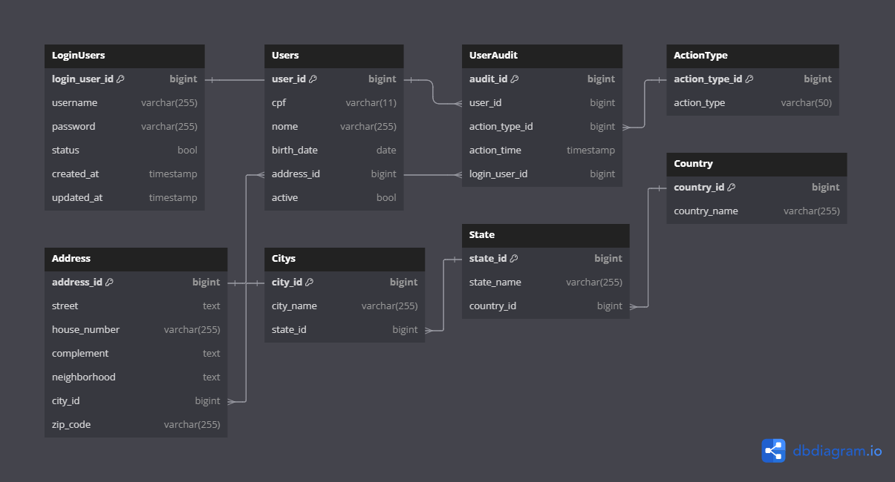

## Language - Idioma

- [English Version](#overview)
- [Versão em Português](#visão-geral)

---

## 🇺🇸 - English Version

---

## Overview

This project is a test assignment for a position at Hospital Sírio-Libanês. My goal is to demonstrate my ability to develop, deploy, and manage a software solution that meets specific requirements.

### Key Features

- **API Testing**: The project includes various endpoints that I use to test different functionalities. The API is documented using Swagger, providing a comprehensive overview of each endpoint, including request parameters and response formats.

- **Database Management**: The project integrates with a database to handle and manage test data. I included Adminer for internal database management, allowing easy access and manipulation of database records.

- **Docker Integration**: Docker is used to containerize the application, facilitating a consistent development and deployment environment. Docker Compose manages the multi-container setup, ensuring that all required services are configured and running smoothly.

### Objectives

- **Follow RESTful Design Principles**: Implement microservices using RESTful principles to ensure a well-structured and scalable architecture.

- **Implement Security with JWT**: Apply JWT standard for authentication and authorization, ensuring secure communication between client and server.

- **Use MySQL for Persistence**: Employ the relational database MySQL for the persistence layer to manage data efficiently.

This project serves as a practical exercise to evaluate my technical skills and approach to software development in the context of a potential role at Hospital Sírio-Libanês.

---

## Technologies Used

- **Node.js**: A JavaScript runtime built on Chrome's V8 JavaScript engine.
- **TypeScript**: A typed superset of JavaScript that compiles to plain JavaScript.
- **Express**: A web application framework for Node.js.
- **TypeORM**: An ORM framework for TypeScript and JavaScript (ES7, ES6, ES5).
- **MySQL**: A relational database management system.
- **Joi**: A schema description language and data validator for JavaScript.
- **Jest**: A testing framework for JavaScript, used for running unit and integration tests.
- **Docker**: A platform for developing, shipping, and running applications inside containers.
- **Docker Compose**: A tool for defining and running multi-container Docker applications.

## Versions Used

- **Node.js**: 18.x
- **TypeScript**: 5.x
- **Express**: 4.x
- **TypeORM**: 0.3.x
- **MySQL**: 8.x
- **Joi**: 17.x
- **Jest**: 29.x
- **Docker**: 24.x
- **Docker Compose**: 2.x

---

## Database Diagram



You can view the database diagram script [here](./dbdiagram.io.sql) or open it online using this link: [dbdiagram.io](https://dbdiagram.io/d/66a8c2f68b4bb5230ebc7894).

---

## Installation

To install the project, follow these steps:

1. Copy the `.env-example` file to `.env` and configure it with your environment-specific settings:
   ```bash
   cp .env-example .env
   ```
2. Edit the .env file to set the following variables:
   ```env
    DB_PASSWORD=your_password
    DB_NAME=your_database_name
    JWT_SECRET=your_secret_key
   ```
3. Install the project dependencies:
   ```bash
    npm install
   ```
4. Build the project:
   ```bash
    npm run build
   ```
5. Start the services using Docker Compose:
   ```bash
    docker-compose up -d --build
   ```

## Usage

- **Swagger API Documentation**: The Swagger API documentation can be accessed at http://localhost:3000/api-docs/. This provides detailed information about the API endpoints and how to use them.

- **Adminer**: Adminer is available for internal database management at http://localhost:8089. This tool allows you to manage and interact with the database directly.

---

## 🇧🇷 - Versão em Português

---

## Visão Geral

Este projeto é um teste para uma vaga no Hospital Sírio-Libanês. Meu objetivo é demonstrar minha capacidade de desenvolver, implantar e gerenciar uma solução de software que atenda a requisitos específicos.

### Principais Funcionalidades

- **Testes de API**: O projeto inclui vários endpoints que uso para testar diferentes funcionalidades. A API é documentada com Swagger, proporcionando uma visão geral completa de cada endpoint, incluindo parâmetros de requisição e formatos de resposta.

- **Gerenciamento de Banco de Dados**: O projeto integra-se com um banco de dados para lidar e gerenciar dados de teste. Incluí o Adminer para gerenciamento interno do banco de dados, permitindo fácil acesso e manipulação dos registros do banco.

- **Integração com Docker**: O Docker é usado para containerizar a aplicação, facilitando um ambiente de desenvolvimento e implantação consistente. O Docker Compose gerencia a configuração de múltiplos containers, garantindo que todos os serviços necessários estejam configurados e funcionando adequadamente.

### Objetivos

- **Utilizar o padrão de projeto RESTful**: Implementar microsserviços seguindo o padrão RESTful para garantir uma arquitetura bem estruturada e escalável.

- **Implementar a camada de segurança com JWT**: Aplicar o padrão JWT para autenticação e autorização, garantindo a segurança das comunicações entre cliente e servidor.

- **Utilizar MySQL para persistência**: Empregar o banco de dados relacional MySQL na camada de persistência para o gerenciamento eficiente dos dados.

Este projeto serve como um exercício prático para avaliar minhas habilidades técnicas e abordagem ao desenvolvimento de software no contexto de uma possível vaga no Hospital Sírio-Libanês.

---

## Tecnologias Utilizadas

- **Node.js**: Um runtime JavaScript construído no motor V8 do Chrome.
- **TypeScript**: Um superconjunto tipado de JavaScript que compila para JavaScript puro.
- **Express**: Um framework para aplicações web em Node.js.
- **TypeORM**: Um framework ORM para TypeScript e JavaScript (ES7, ES6, ES5).
- **MySQL**: Um sistema de gerenciamento de banco de dados relacional.
- **Joi**: Uma linguagem de descrição de esquemas e validador de dados para JavaScript.
- **Jest**: Um framework de testes para JavaScript, usado para rodar testes unitários e de integração.
- **Docker**: Uma plataforma para desenvolver, enviar e executar aplicações dentro de contêineres.
- **Docker Compose**: Uma ferramenta para definir e rodar aplicações Docker de múltiplos contêineres.

## Versões Utilizadas

- **Node.js**: 18.x
- **TypeScript**: 5.x
- **Express**: 4.x
- **TypeORM**: 0.3.x
- **MySQL**: 8.x
- **Joi**: 17.x
- **Jest**: 29.x
- **Docker**: 24.x
- **Docker Compose**: 2.x

---

## Diagrama do Banco de Dados


Você pode visualizar o script do diagrama do banco de dados [aqui](./dbdiagram.io.sql) ou abri-lo online usando este link: [dbdiagram.io](https://dbdiagram.io/d/66a8c2f68b4bb5230ebc7894).

---

## Instalação

Para instalar o projeto, siga estas etapas:

1. Copie o arquivo `.env-example` para `.env` e configure-o com suas configurações específicas do ambiente:
   ```bash
   cp .env-example .env
   ```
2. Edite o arquivo .env para definir as seguintes variáveis:
   ```env
    DB_PASSWORD=your_password
    DB_NAME=your_database_name
    JWT_SECRET=your_secret_key
   ```
3. Instale as dependências do projeto:
   ```bash
    npm install
   ```
4. Construa o projeto:
   ```bash
    npm run build
   ```
5. Inicie os serviços usando o Docker Compose:
   ```bash
    docker-compose up -d --build
   ```

## Uso

- **Documentação da API Swagger**: A documentação da API Swagger pode ser acessada em http://localhost:3000/api-docs/. Isso fornece informações detalhadas sobre os endpoints da API e como usá-los.

- **Adminer**: O Adminer está disponível para gerenciamento interno do banco de dados em http://localhost:8089. Esta ferramenta permite que você gerencie e interaja com o banco de dados diretamente.
